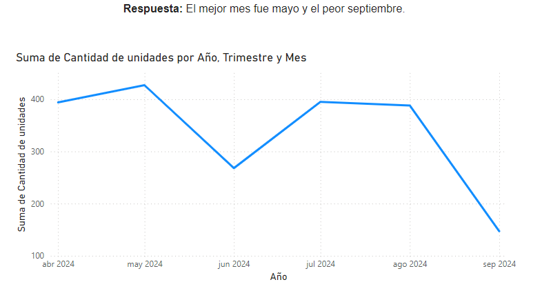
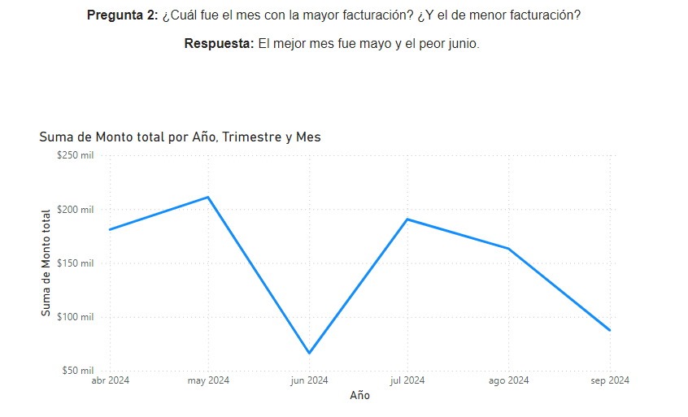
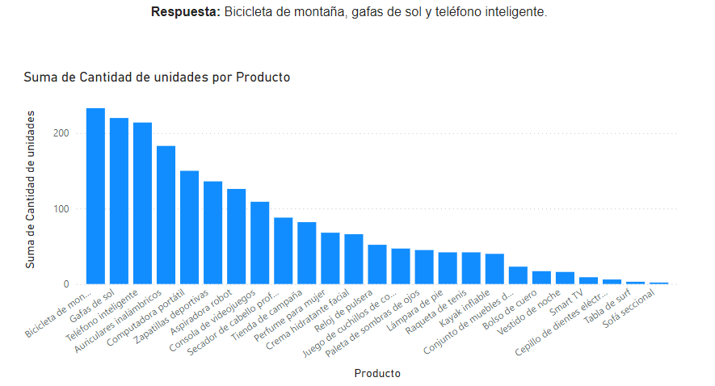
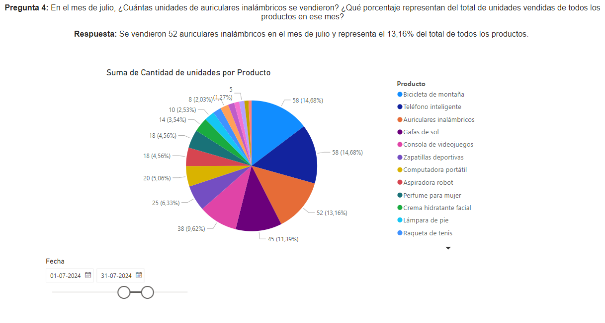
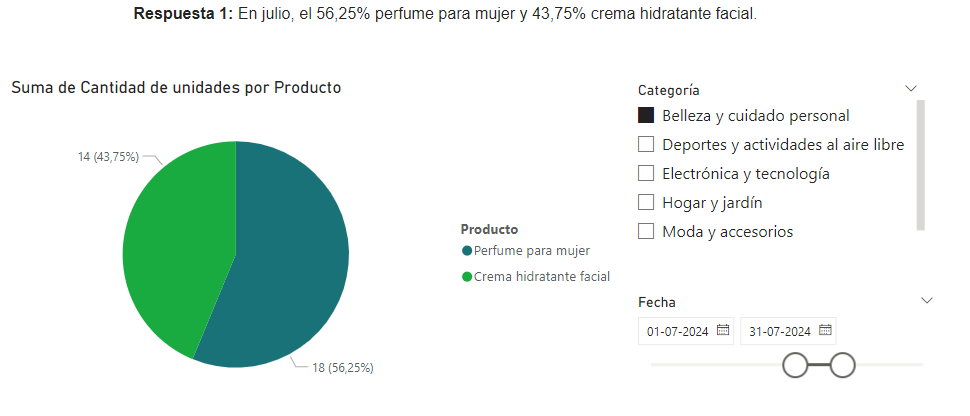
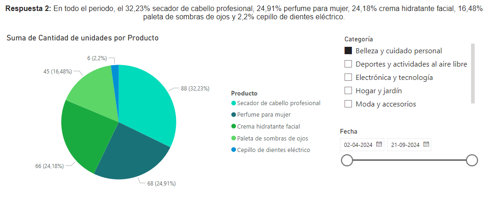
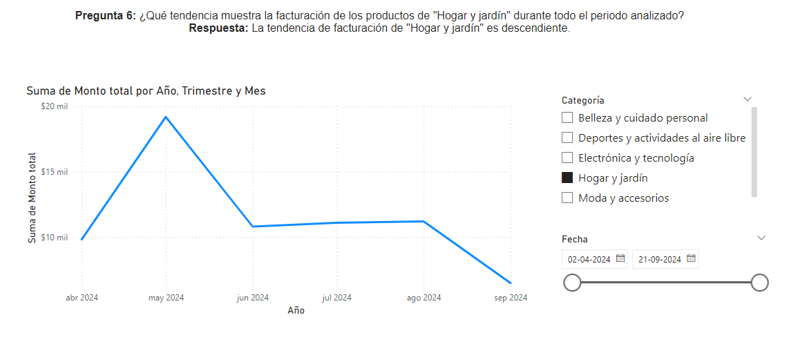

# Análisis de Ventas de Productos en Línea

Este proyecto analiza datos de ventas de productos en línea y proporciona información sobre las tendencias de ventas, los productos más vendidos y el rendimiento de distintas categorías.

## Preguntas respondidas:
1. **¿Cuál fue el mes con la mayor y menor cantidad de ventas en unidades de productos?**

2. **¿Cuál fue el mes con la mayor y menor facturación?**

3. **¿Cuáles son los 3 productos con la mayor cantidad de unidades vendidas durante todo el periodo?**

4. **En julio, ¿cuántas unidades de auriculares inalámbricos se vendieron y qué porcentaje representaron del total de ventas en ese mes?**

5. **¿Cómo estuvieron compuestas las ventas de productos de belleza y cuidado personal en julio y en todo el periodo analizado?**

6. **¿Qué tendencia muestra la facturación de los productos de "Hogar y jardín" durante todo el periodo analizado?**

